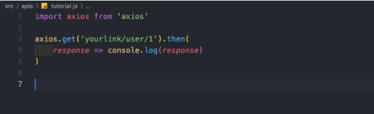
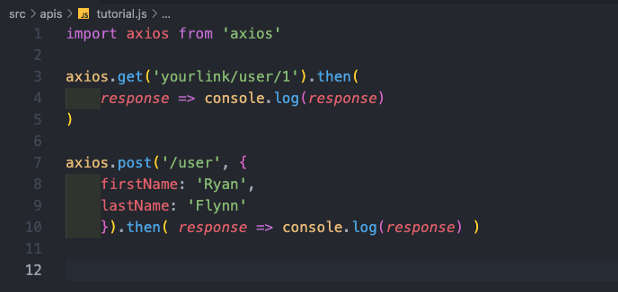
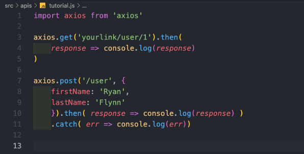

## [**Axios**](https://github.com/axios/axios)

Promise based HTTP client for the browser and node.js.

**What is Axios?**
In simple terms Axios is a very popular JavaScript library that allows you to make HTTP requests to a RESTful or a GraphQL API. Axios accomplishes the same task as the fetch API provided by many browsers. Under the hood Axios makes use of Promises. 

Adding Axios to your project. To accomplish this just run the following command in your terminal (always make sure you are in the correct directory):

```
npm install axios
```
If you use yarn, the following command will work for you:
```
yarn add axios
```


**Using Axios**
Below is an example that can illustrate my last point.

**Writing a Get Request**
To write a GET request in Axios we first need to import our Axios library (I am using react, but if you use vanilla JS then use const axios = require(‘axios’);instead). After you’ve imported it all you have to do is simply call axios.get() with the link you are requesting data from. After that, you should call.then() , and you will have your response already! No need for any further parsing. This will give you a response with all the data you requested, the configuration, the headers, the type of request, and the request’s status.




**Writing a Post Request**
Writing a POST request is almost exactly like our GET request except all we need to do is pass in the object we want to add to our database.




**Error Handling**
This is the greatest part of Axios for me because it automatically helps you detect errors and subsequently catch them.



[View Documentation](https://github.com/axios/axios) 